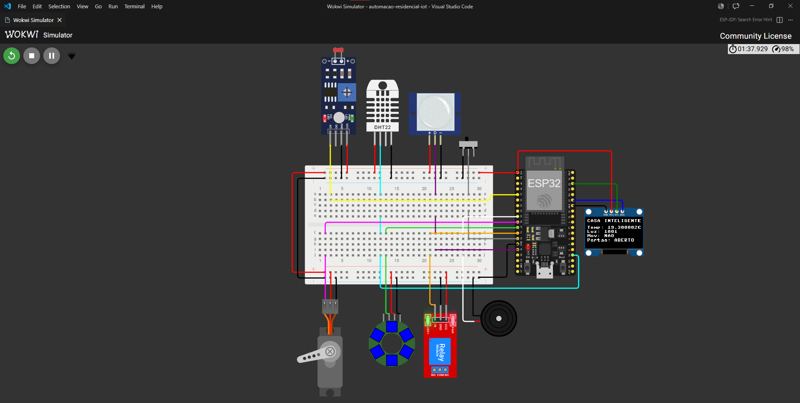
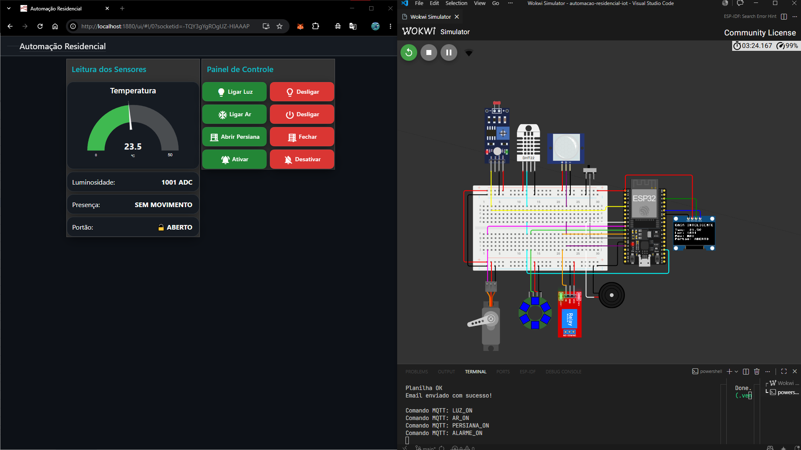
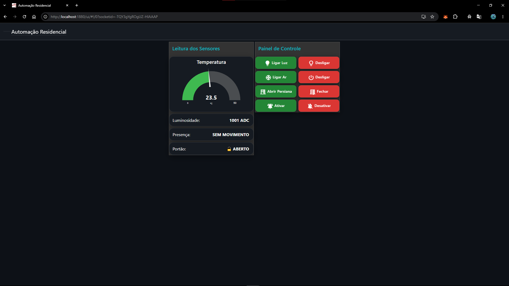
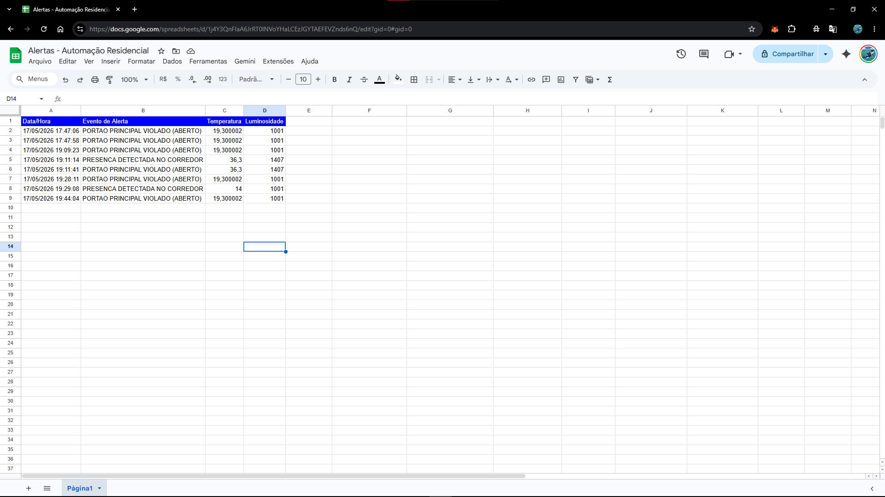
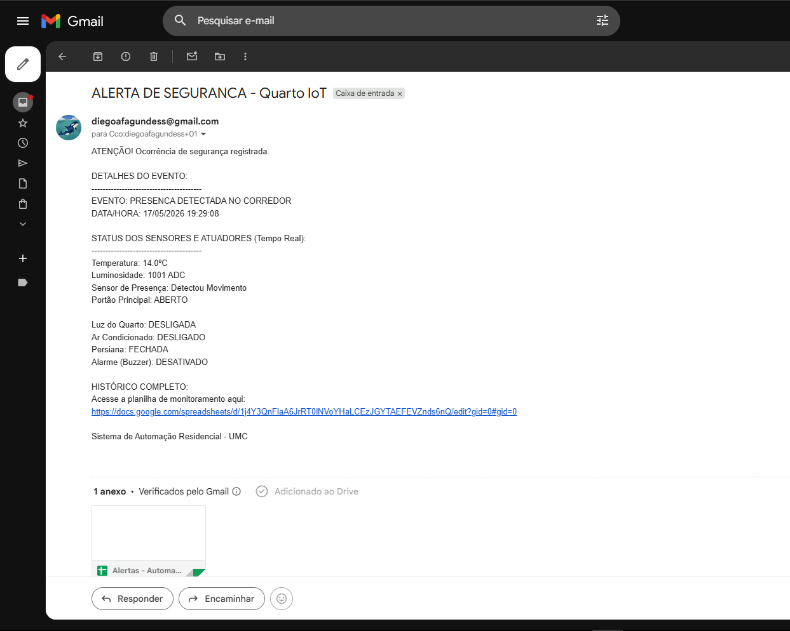

# Automação Residencial com IoT

Sistema de automação residencial com ESP32, Wokwi, MQTT, sensores e dashboard no Node-RED.

## Visão Geral

Este projeto simula um quarto inteligente, com sensores e atuadores trabalhando juntos para automatizar tarefas do ambiente e permitir monitoramento remoto via MQTT.

Funcionalidades principais:

- Acionamento do ar-condicionado automaticamente conforme a temperatura medida pelo DHT22.
- Abertura/fechamento da persiana (servo) de acordo com a luminosidade medida pela LDR.
- Iluminação do corredor acionada por presença detectada pelo sensor PIR.
- Alerta sonoro (buzzer) caso o sensor de porta/slide-switch detecte que o portão foi aberto.

Fluxo principal:

1. O ESP32 é executado no Wokwi.
2. O arquivo `main.py` lê os sensores e publica os dados no broker MQTT.
3. O Node-RED recebe os dados e exibe a dashboard.
4. A dashboard envia comandos de volta ao ESP32 para controle manual ou automático.

## Wokwi Sumulator

Espaço reservado para colocar um print do simulador depois.

## Sensores e Atuadores

### Sensores

- DHT22
- PIR
- LDR
- Slide-switch

### Atuadores

- Servo motor
- Relay
- Buzzer
- NeoPixel

## Legenda Dos Cabos

- cabo preto = terra
- cabo vermelho = energia
- cabo azul = sda do ssd1306
- cabo verde = scl do ssd1306
- cabo azul claro = dht22
- cabo amarelo = ldr
- cabo roxo = pir
- cabo cinza = slide-switch
- cabo rosa = servo motor
- cabo verde claro = neopixel
- cabo laranja = relay
- cabo branco = buzzer

## Prints Do Projeto

### Projeto no Wokwi Simulator do VS Code



### Integração do Wokwi com o Node-RED



### Dashboard no Node-RED



### Planilha



### Email enviado ao proprietário



## O Que Você Precisa

- VS Code
- Extensão **Wokwi Simulator**
- Python instalado no computador
- Node-RED instalado localmente
- Conexão com a internet para acessar o broker MQTT público

## Estrutura Do Projeto

- `esp32/main.py`: lógica principal do ESP32
- `esp32/ssd1306.py`: driver do display OLED
- `esp32/diagram.json`: ligações dos componentes no Wokwi
- `scripts/upload_and_run.py`: envia os arquivos para o ESP32 simulado

## Passo a Passo

### 1. Abrir o projeto

Clone o repositório e abra a pasta no VS Code.

```powershell
git clone https://github.com/Diego251Fagundes/automacao-residencial-iot.git
```

### 2. Iniciar o Wokwi

No VS Code, instale a extensão **Wokwi Simulator**. Depois pressione `F1`, procure por `Wokwi: Start Simulator` e abra o simulador.

Importante: mantenha o Wokwi aberto e, se possível, dividido na tela. Se ele for para segundo plano, a simulação pode parar.

### 3. Enviar o código para o ESP32

Abra um terminal na pasta do projeto e execute:

```powershell
python scripts/upload_and_run.py --local esp32/main.py --remote main.py
```

Esse comando envia o `main.py` e os módulos locais necessários para o ESP32 simulado.

### 4. Abrir o Node-RED

Abra outro terminal no computador e digite:

```powershell
node-red
```

Copie o endereço exibido no terminal, normalmente algo como:

```text
http://127.0.0.1:1880/
```

Abra esse endereço no navegador.

### 5. Importar o fluxo do Node-RED
- Clique no menu do Node-RED.
- Escolha a opção de importar.
- Selecione o arquivo `nodered/flows.json`.
- Clique em **Implementar**.

### 6. Abrir a dashboard

Depois de importar e implementar o fluxo, abra a dashboard no navegador:

```text
http://localhost:1880/ui
```

Essa página mostra os controles e os dados da automação integrados com o Wokwi.

## Como Funciona

- O ESP32 conecta no Wi-Fi do Wokwi.
- O código lê DHT22, PIR, LDR e sensor de porta.
- Os dados são publicados no broker MQTT.
- O Node-RED exibe os dados na dashboard.
- Os comandos da dashboard retornam ao ESP32 via MQTT.

## Dicas Importantes

- Mantenha o Wokwi aberto durante toda a execução.
- Se o simulador ficar em segundo plano, ele pode pausar.
- Verifique se o broker MQTT público está acessível.
- Se o upload falhar, execute novamente o comando de envio.